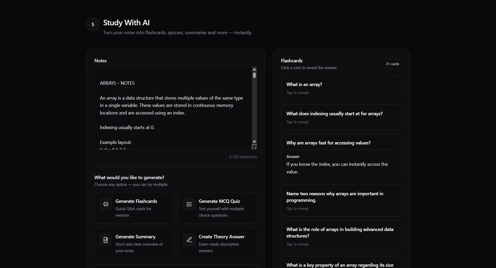
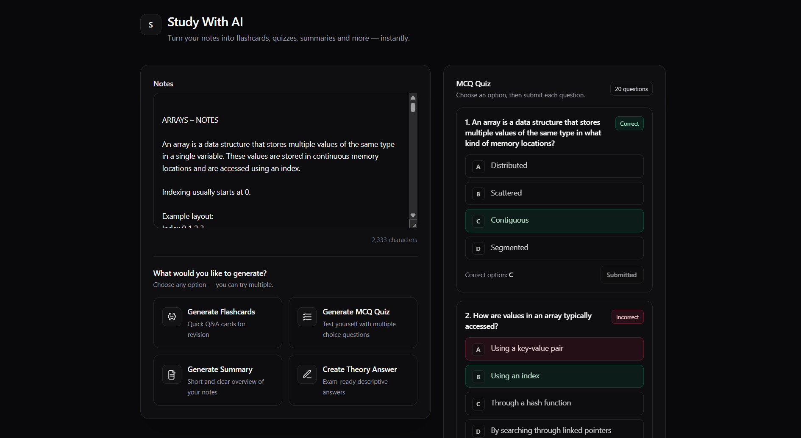
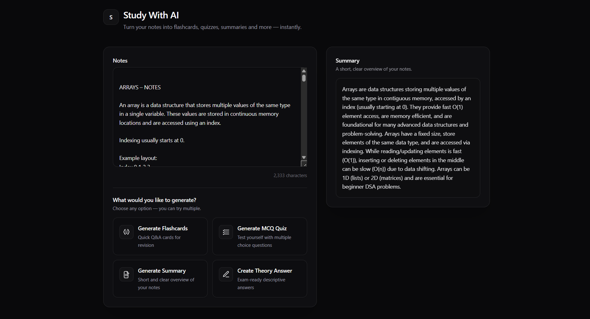

# Study With AI (Construction In Progress)

Study with AI helps students prepare for school and college exams using LLMs, but in a more visual and interactive way.
Normal LLMs usually reply with long paragraphs, which are hard to read, especially now when attention span is going downhill.
So this tool focuses on giving students visual answers like diagrams, flowcharts, tables, short summaries, and small quizzes, making studying easier, faster, and way more engaging.

# Work by far 
- Generate Flashcards from notes in one click using AI.
- Generate MCQ Quiz from notes
- Generate Summary of notes
- Frontend

### Flashcards

### Quiz

### Summary

